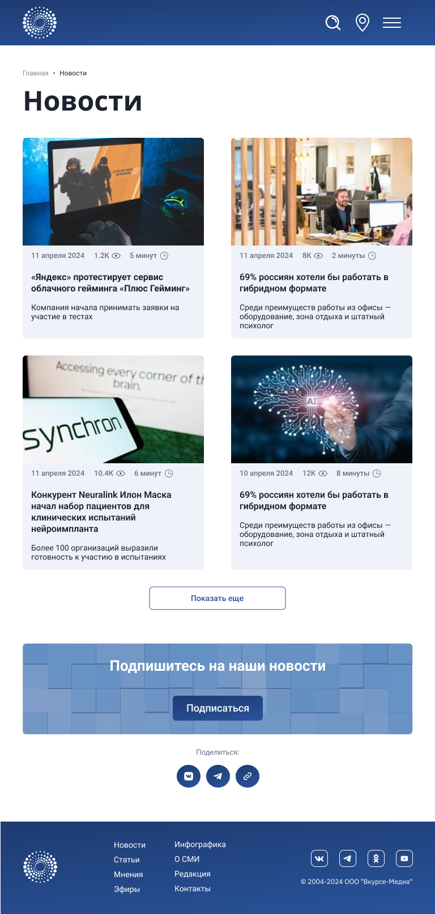
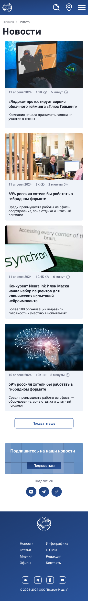

<h1 align="center"><i>I am laying out the Vkurse layout page using the rules of flexible, adapted layout.</i></h1>

<h2 align="center">Vkurse - Desktop(1440 x 1671)</h2>

  

<h2 align="center">Vkurse - Tablet(768 x 1612)</h2>

  

<h2 align="center">Vkurse - Mobile(360 x 2436)</h2>

  

